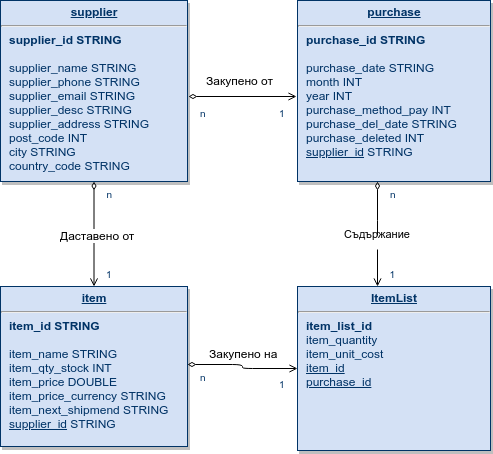
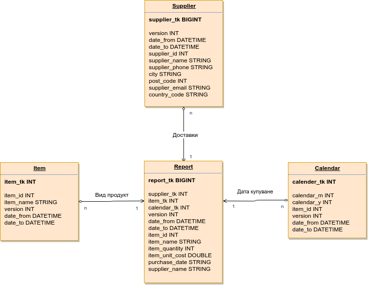

# Extract Transform Load
For one of my CS subjects, I had to implement an ETL process to extract the data from an OLTP DB, transform it and then load it into an OLAP.

I have created a use case for an IoT company that wants to have an ETL process for their Data Warehouse where they could monitor the number of parts they are currently having, have ordered and their cost.

I ended up proposing two solutions to this task:
- Implemented an ETL process using Pentaho Data Integration / Spoon.
- Implemented an ETL process using nothing but Python to build the same logic as the one created via PDI.

# Prerequisites
To run the Python 3 ETL script, you'd need to have MySQL Connector installed:
```
$ sudo apt-get install python3-mysql.connector
```
To have any data to work with, you'd need to import the example data. It is located in __DB_CSV__ folder. It is structured to be easily imported in MySQL.

In folder Python_ETL, in file etl.py, you'd need to set up the connection properties to your MySQL servers where the OLTP and OLAP DBs are:
- host ip (string)
- user (string)
- passwd (string)
- database (string)

# OLTP schema


# OLAP schema


# License
BSD License
>Copyright (c) 2019, Tihomir Mladenov, tihomir.mladenov777@gmail.com
All rights reserved.

>Redistribution and use in source and binary forms, with or without
modification, are permitted provided that the following conditions are met:

>1. Redistributions of source code must retain the above copyright notice, this
   list of conditions and the following disclaimer.
>2. Redistributions in binary form must reproduce the above copyright notice,
   this list of conditions and the following disclaimer in the documentation
   and/or other materials provided with the distribution.

>THIS SOFTWARE IS PROVIDED BY THE COPYRIGHT HOLDERS AND CONTRIBUTORS "AS IS" AND
ANY EXPRESS OR IMPLIED WARRANTIES, INCLUDING, BUT NOT LIMITED TO, THE IMPLIED
WARRANTIES OF MERCHANTABILITY AND FITNESS FOR A PARTICULAR PURPOSE ARE
DISCLAIMED. IN NO EVENT SHALL THE COPYRIGHT OWNER OR CONTRIBUTORS BE LIABLE FOR
ANY DIRECT, INDIRECT, INCIDENTAL, SPECIAL, EXEMPLARY, OR CONSEQUENTIAL DAMAGES
(INCLUDING, BUT NOT LIMITED TO, PROCUREMENT OF SUBSTITUTE GOODS OR SERVICES;
LOSS OF USE, DATA, OR PROFITS; OR BUSINESS INTERRUPTION) HOWEVER CAUSED AND
ON ANY THEORY OF LIABILITY, WHETHER IN CONTRACT, STRICT LIABILITY, OR TORT
(INCLUDING NEGLIGENCE OR OTHERWISE) ARISING IN ANY WAY OUT OF THE USE OF THIS
SOFTWARE, EVEN IF ADVISED OF THE POSSIBILITY OF SUCH DAMAGE.

>The views and conclusions contained in the software and documentation are those
of the authors and should not be interpreted as representing official policies,
either expressed or implied, of the ETL project.
